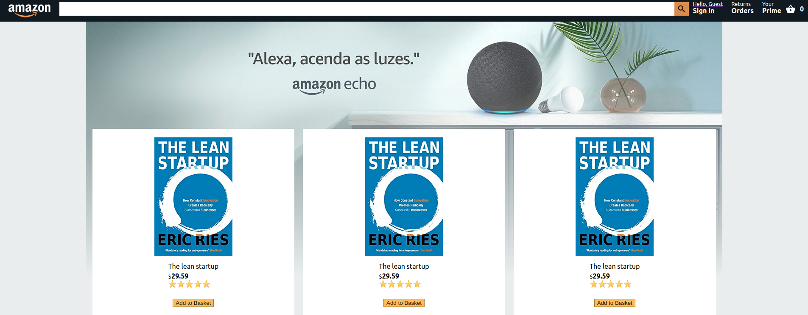

<h1 align="center">
  
</h1>

# Amazon Clone

Implementation of an e-commerce in React, based on Amazon.com

<h1 align="center">
  
</h1>

## About

- Authentication
- Animations
- Payments
- Firebase
